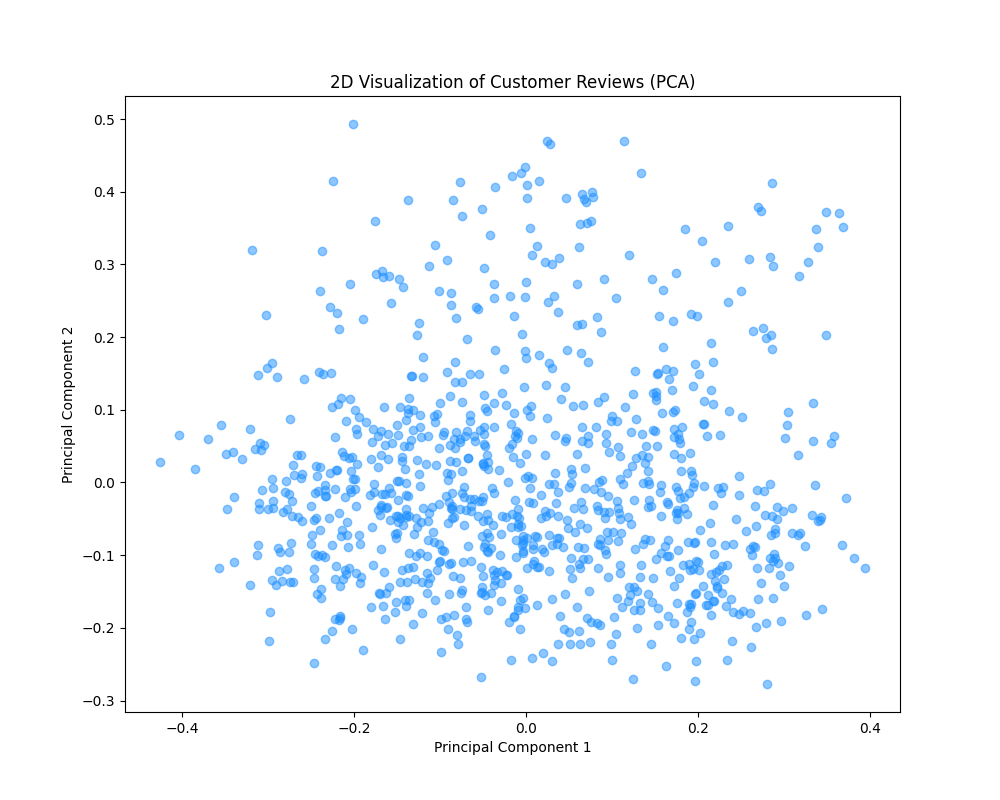

# Topic Analysis of Clothing Reviews with Embeddings

In the competitive world of e-commerce, understanding customer feedback is vital for business success. This project focuses on analyzing reviews from the Women's Clothing E-Commerce Reviews dataset. Through text embeddings, dimensionality reduction, and vector databases, I transform unstructured text into actionable insights and personalized service tools.

## What This Project Does

This script automatically extracts patterns and themes from customer text reviews using Natural Language Processing (NLP) and Artificial Intelligence. 

### 1. **Semantic Embeddings Generation**
I use OpenAI's `text-embedding-3-small` model to convert the raw text of each customer review into dense numerical vectors (embeddings). This allows the system to understand the true semantic *meaning* of the text rather than just matching repetitive keywords. The embeddings are stored persistently in a local **ChromaDB** vector database (`./chroma_db`), ensuring fast performance and eliminating redundant API costs upon subsequent runs.

### 2. **Dimensionality Reduction & Visualization**
High-dimensional text embeddings are impossible to visualize directly. The script uses **Principal Component Analysis (PCA)** from `scikit-learn` to reduce the embeddings down to two dimensions. This allows us to plot the entire dataset on a 2D scatter plot, visually revealing hidden clusters of similar customer sentiments.



### 3. **Feedback Categorization**
To categorize the feedback into specific actionable business themes (`quality`, `fit`, `style`, `comfort`), the script embeds these category keywords via OpenAI and calculates the **cosine similarity** between the category vectors and the customer review vectors. Every review is then automatically tagged with its most relevant theme.

### 4. **AI-Powered Similarity Search**
Using the native cross-encoder querying capabilities of **ChromaDB**, the script provides a search function that takes any target review (e.g., *"Absolutely wonderful - silky and sexy and comfortable"*) and instantly identifies the top closest matching reviews from the historical dataset. This is highly valuable for identifying broader trends triggered by a single piece of feedback or providing hyper-personalized customer service automation.

## Setup Instructions

1. Clone the repository to your local machine.
2. Install the required dependencies using your preferred virtual environment:
   ```bash
   pip install -r requirements.txt
   ```
3. Store your dataset in the `/data` folder as follows:
   `data/womens_clothing_e-commerce_reviews.csv`
4. Create a `.env` file in the root directory and add your OpenAI Key:
   `OPENAI_API_KEY="sk-..."`

## Usage

Simply run the main analysis script from your terminal:

```bash
python clothing_reviews_analysis.py
```

The script will attempt to load the pre-calculated embeddings directly from the embedded `chroma_db` folder. If they do not exist or you change the dataset, it will connect to the OpenAI API in safe batches, generate the semantic vectors, and store them locally before generating the PCA plot and printing analytical insights to your console.
